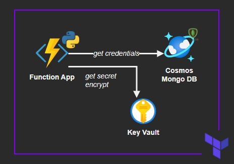

# Azure Functions - Terraform Prototype

Putting some technologies together as a prototype for my next project.

- Serverless - Azure Functions with a consumption plan
- NoSQL - CosmosDB with a MongoDB interface
- Cloud security - Azure Key Vault to encrypt and decrypt sensitive data, as well for getting secrets
- Infrastructure-as-code - Terraform




## Local development

Check the infrastructure section below to create the Azure resources.

Requirements:
- Azure Functions Core Tools
- Terraform CLI

Setup:

```sh
# set the variables in this file
cp local.settings.development.json local.settings.json

# download dependencies
python3 -m venv env
. env/bin/activate
pip install -r requirements.txt
```

Start Functions locally:

```sh
func start
```

Functions:

```sh
# Load questions
curl localhost:7071/api/LoadQuestions

# Post answers
curl --data '@shared_code/answers.json' http://localhost:7071/api/PostAnswers

#Get answers
curl http://localhost:7071/api/GetAnswers?id=participant@mail.com
```

## Infrastructure


```sh
az login

terraform init
terraform plan
terraform apply -auto-approve
```

### Local Development 

Extra steps for local development.

Create the app registration:

```sh
az ad app create --display-name myproj888 --password '<STRONG_SECRET>'
```

Add the app credentials to `local.settings.json`.

In the Key Vault add a `Access Policy` for the app with KEY operations `Get`, `Decrypt` and `Encrypt`

## Sources

[Azure Functions Python developer guide](https://docs.microsoft.com/en-us/azure/azure-functions/functions-reference-python)

[Azure KeyVault Keys - Python SDK](https://pypi.org/project/azure-keyvault-keys/)

[Azure Identity - Python SDK](https://github.com/Azure/azure-sdk-for-python/tree/master/sdk/identity/azure-identity)
